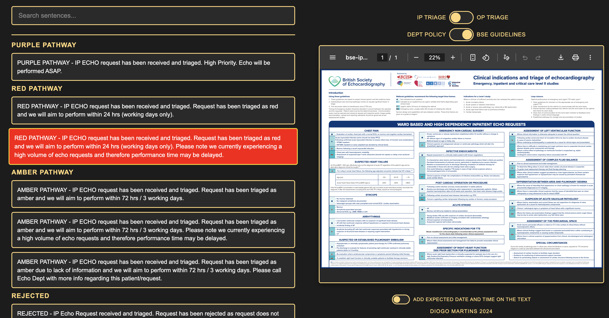

# Echo Triage

A web application for Echo Triage system that helps medical staff quickly generate and copy standardized response sentences for inpatient (IP) and outpatient (OP) echo requests.



## Features

### Dual Mode Support
- **IP Triage Mode**: For inpatient echo requests with color-coded pathways (Purple, Red, Amber, Green)
- **OP Triage Mode**: For outpatient echo requests with priority levels (High Priority, Urgent, Indicated, Not Indicated)

### Interactive Features
- **One-click Copy**: Click any sentence to copy it to your clipboard
- **Search Functionality**: Real-time search to filter sentences by keywords
- **Previous Echo Integration**: When clicking sentences containing "PREVIOUS ECHO.", a modal prompts you to enter previous echo details
- **Expected Date/Time**: Optional toggle to automatically add expected date and time to sentences
- **PDF Guidelines**: Toggle between Department Policy and BSE Guidelines PDFs (IP mode) or view BSE Guidelines only (OP mode)

### Color-Coded Pathways

#### IP Mode
- 🟣 **Purple Pathway**: High Priority - ASAP
- 🔴 **Red Pathway**: Within 24 hours (working days)
- 🟡 **Amber Pathway**: Within 72 hours / 3 working days
- 🟢 **Green Pathway**: Standard requests

#### OP Mode
- 🟣 **High Priority**: Purple color
- 🔴 **Urgent**: Red color - within 2 weeks
- 🟡 **Indicated**: Amber color - within 72 hours
- 🔵 **Not Indicated**: Blue color

## File Structure

```
EchoTriage/
├── index.html              # Main application file
├── sentences-ip.txt        # IP mode sentence templates
├── sentences-op.txt        # OP mode sentence templates
├── policy-ip.pdf          # Department Policy (IP mode)
├── bse-ip.pdf             # BSE Guidelines (IP mode)
├── bse-op.pdf             # BSE Guidelines (OP mode)
├── favicon.ico            # Application icon
└── OLD/                   # Legacy versions
```

## Usage

1. **Select Mode**: Toggle between "IP Triage" and "OP Triage" modes
2. **Choose Guidelines**: Toggle between "Dept Policy" and "BSE Guidelines" PDFs (IP mode only)
3. **Search**: Use the search bar to filter sentences by keywords
4. **Copy Sentence**: Click any sentence to copy it to your clipboard
5. **Add Previous Echo**: When clicking sentences with "PREVIOUS ECHO.", enter the details in the modal
6. **Expected Date/Time**: Enable the toggle above the author name to automatically add expected dates

## Previous Echo Feature

When a sentence contains "PREVIOUS ECHO.":
- Clicking the sentence opens a modal
- Enter the previous echo date and summary (minimum 8 characters)
- Click "Add previous echo information" to insert the text
- Click "No previous echo" to remove the "PREVIOUS ECHO." part entirely

## Technical Details

- **Pure HTML/CSS/JavaScript**: No dependencies or build process required
- **Client-side Processing**: All functionality runs in the browser
- **Responsive Design**: Optimized for desktop use
- **Modern Browser Support**: Uses Clipboard API with fallback for older browsers

## Customization

### Adding New Sentences

Edit the appropriate text file:
- `sentences-ip.txt` for IP mode sentences
- `sentences-op.txt` for OP mode sentences

Format:
```
- SUBGROUP NAME
-- Sentence text here
-- Another sentence in the same subgroup
```

### Updating PDFs

Replace the PDF files:
- `policy-ip.pdf` - Department Policy for IP mode
- `bse-ip.pdf` - BSE Guidelines for IP mode
- `bse-op.pdf` - BSE Guidelines for OP mode

## Browser Compatibility

- Chrome/Edge (recommended)
- Firefox
- Safari
- Modern browsers with Clipboard API support

## License

This project is for internal use.

## Author

Diogo Martins

